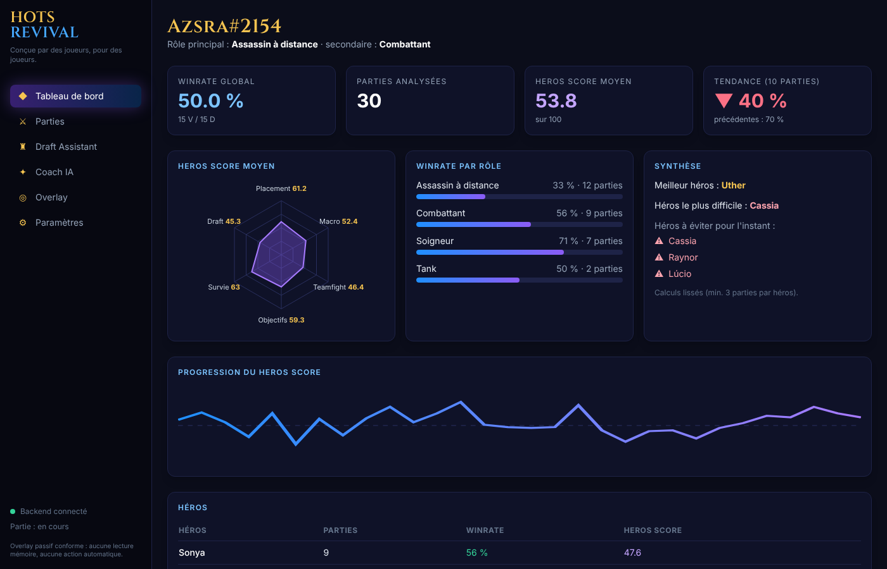
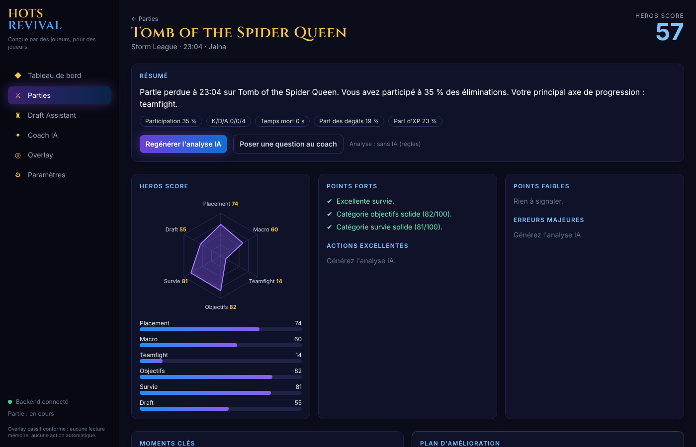
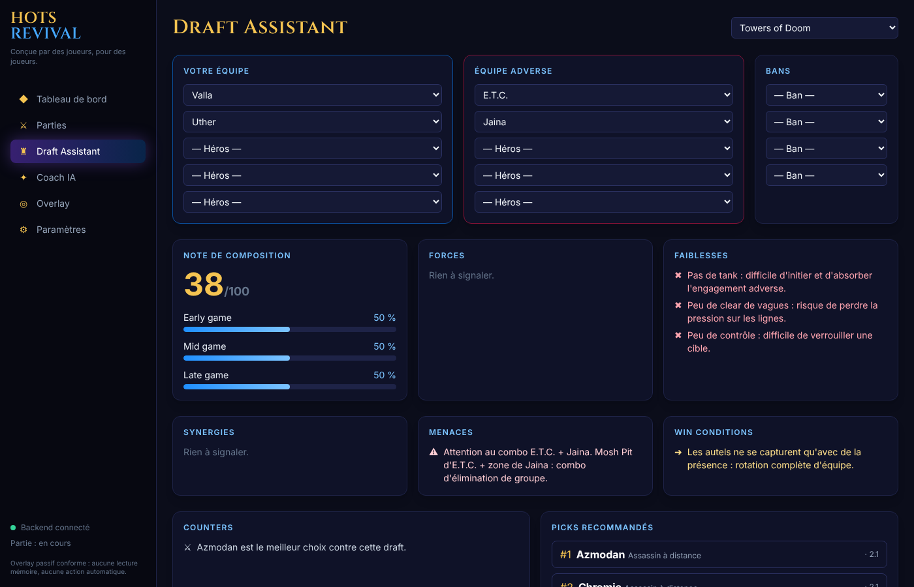
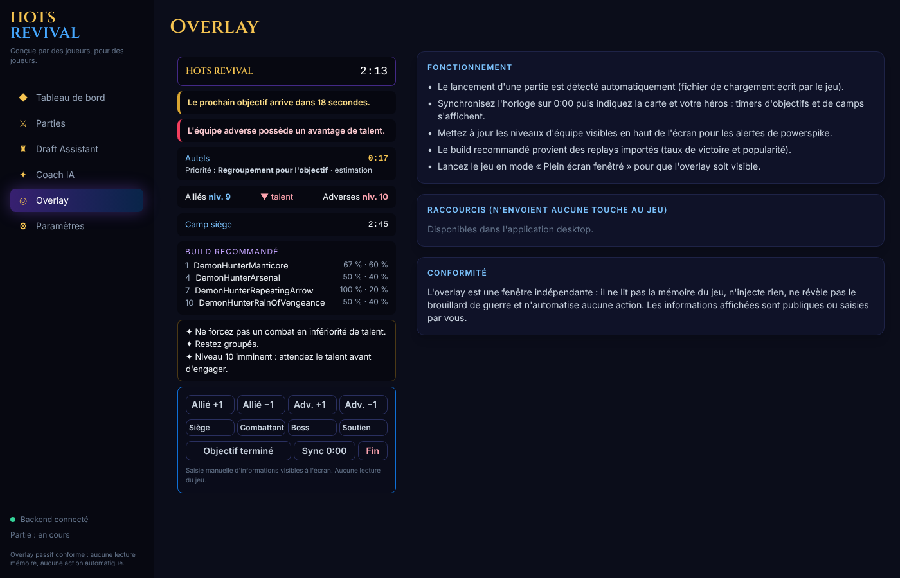

# HOTS REVIVAL

> **Conçue par des joueurs, pour des joueurs.**
> Une intelligence artificielle qui vous accompagne avant, pendant et après chaque partie de *Heroes of the Storm*.

HOTS REVIVAL vise à devenir le « Porofessor » de Heroes of the Storm : profil joueur, Draft Assistant, overlay passif en jeu, rapport post-partie, **HEROS SCORE** et coach personnel propulsé par Claude.

**Conforme aux conditions d'utilisation Blizzard par conception :** aucune lecture ou écriture mémoire, aucune injection, aucune macro ni automatisation, aucune information cachée. Seuls les fichiers que le jeu écrit sur le disque (replays, fichier de lobby), les informations publiques et vos propres saisies sont utilisés. → [docs/02-conformite-blizzard.md](docs/02-conformite-blizzard.md)

| Tableau de bord | Rapport post-partie |
|---|---|
|  |  |
| **Draft Assistant** | **Overlay en jeu** |
|  |  |

*(captures réalisées avec les données de démonstration)*

## Modules

| Module | Contenu | Où |
|---|---|---|
| 1. Profil joueur | Winrates global / rôle / héros, tendances, progression, meilleur / pire héros, rôles, héros à éviter | `analytics/profile_stats.py`, page Tableau de bord |
| 2. Draft Assistant | Forces, faiblesses, synergies, menaces (ex. combo E.T.C. + Jaina), counters, win conditions, early/mid/late, picks recommandés | `draft/engine.py`, page Draft |
| 3. Overlay temps réel | Horloge, prochain objectif et priorité, camps, powerspikes, build de talents, conseils | `live/`, fenêtre overlay Electron |
| 4. Coach IA | Chat Claude en streaming qui connaît votre historique | `coach/`, page Coach IA |
| 5. Analyse de replays | Surveillance du dossier, parsing (heroprotocol officiel), base de données | `replay/` |
| 6. Post Game Report | Résumé, points forts / faibles, moments clés, erreurs, actions excellentes, plan d'amélioration | `analytics/report.py`, page Rapport |
| 7. HEROS SCORE | Placement, Macro, Teamfight, Objectifs, Survie, Draft → note /100 | `analytics/heros_score.py` |

## Démarrage rapide (développement)

Prérequis : Python ≥ 3.11, Node.js ≥ 20, (optionnel) Docker pour PostgreSQL.

```bash
# 1. Base de données
docker compose up -d                      # ou HOTS_DATABASE_URL=sqlite:///hots.db

# 2. Backend
cd backend
python -m venv .venv && .venv\Scripts\activate      # (Linux/macOS : source .venv/bin/activate)
pip install -e ".[dev]"
copy .env.example .env                              # renseigner HOTS_REPLAY_DIR et ANTHROPIC_API_KEY
python scripts/seed_demo.py                         # (optionnel) 30 parties de démonstration
uvicorn app.main:app --port 8765 --reload           # API + docs interactives : http://127.0.0.1:8765/docs
pytest                                              # tests (dont conformité)

# 3. Application desktop
cd ../apps/desktop
npm install
npm run dev                                         # Vite + Electron (HOTS_SPAWN_BACKEND=1 pour lancer le backend automatiquement)
```

Dossier de replays par défaut (détecté automatiquement sinon) :
`C:\Users\azsra\Documents\Heroes of the Storm\Accounts\137044993\2-Hero-1-1278570\Replays\Multiplayer`
— le joueur local est identifié par le *toon handle* `2-Hero-1-1278570` déduit du chemin.

Le jeu doit être en **plein écran fenêtré** pour que l'overlay soit visible.

### Raccourcis de l'overlay (ils n'envoient aucune touche au jeu)
| Raccourci | Action |
|---|---|
| Ctrl+Shift+O | Afficher / masquer l'overlay |
| Ctrl+Shift+I | Mode interactif (cliquer dans l'overlay) |
| Ctrl+Shift+S | Synchroniser l'horloge sur 0:00 |
| Ctrl+Shift+PageUp / PageDown | Niveau allié / adverse +1 |
| Ctrl+Shift+J | Objectif terminé |

## Stack
React · TypeScript · Tailwind · Electron · Python · FastAPI · PostgreSQL · Claude API (SDK Anthropic) · Sentry · PostHog

## Documentation
| # | Livrable |
|---|---|
| 1 | [Architecture complète + diagrammes](docs/01-architecture.md) |
| 2 | [Contraintes et conformité Blizzard](docs/02-conformite-blizzard.md) |
| 3 | [Stratégie temps réel sans lecture mémoire](docs/03-strategie-temps-reel.md) |
| 4 | [MVP en 30 jours](docs/04-mvp-30-jours.md) |
| 5 | [Roadmap V2](docs/05-roadmap-v2.md) |
| 6 | [Base de données](docs/06-base-de-donnees.md) · [DDL](backend/sql/schema.sql) |
| 7 | [Schémas d'API](docs/07-api.md) |
| 8 | [Backlog complet & user stories](docs/08-backlog-user-stories.md) |
| 9 | [Wireframes](docs/09-wireframes.md) |
| 10 | [HEROS SCORE](docs/10-heros-score.md) |
| 11 | [Plan de développement](docs/11-plan-developpement.md) |
| 12 | [Structure des dossiers](docs/12-structure-dossiers.md) |

## État et limites connues
- Le parser est testé sur des replays **synthétiques** au format heroprotocol ; la validation sur un corpus de replays réels du build courant est la première tâche du sprint 1.
- Les timings d'objectifs (`backend/app/data/maps.json`) sont indicatifs (`verified: false`) et affichés comme estimations.
- Les profils de héros du Draft Assistant et les seuils du HEROS SCORE sont des valeurs éditoriales v1, à calibrer sur données.
- Le schéma est créé par `create_all` ; les migrations Alembic arrivent avant la première release publique.

*Heroes of the Storm est une marque de Blizzard Entertainment. HOTS REVIVAL est un projet indépendant, non affilié à Blizzard.*
