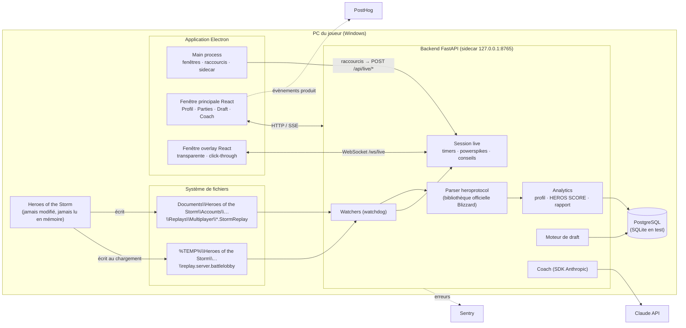
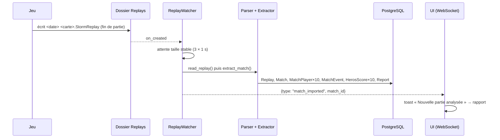
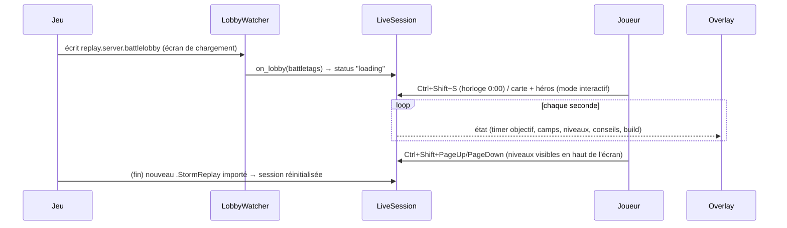
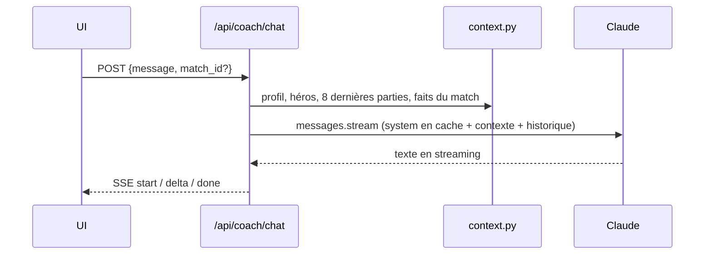
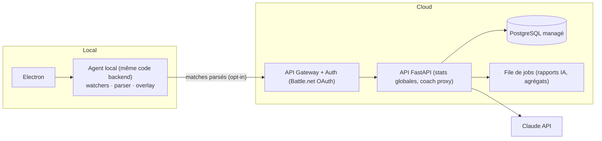

# 1. Architecture globale

> **HOTS REVIVAL** — « Conçue par des joueurs, pour des joueurs. Une intelligence artificielle qui vous accompagne avant, pendant et après chaque partie. »

## 1.1 Principes directeurs

| Principe | Conséquence technique |
|---|---|
| **Conformité Blizzard d'abord** | Aucun accès au processus du jeu. Seules sources : fichiers écrits par le jeu sur disque, saisies du joueur, données publiques (voir [02-conformite-blizzard.md](02-conformite-blizzard.md)). |
| **Local-first** | Le parsing et le stockage tournent sur le PC du joueur : latence nulle, fonctionne hors ligne, données personnelles chez le joueur. |
| **Déterministe d'abord, IA ensuite** | Statistiques, HEROS SCORE, draft et alertes overlay sont calculés par du code testable. Claude **explique, priorise et personnalise** à partir de ces faits ; il n'invente pas de données. |
| **Aucun LLM pendant la partie** | L'overlay temps réel est 100 % règles (latence, coût, distraction). Claude intervient avant (draft) et après (rapport, coach). |
| **Un seul backend, deux déploiements** | MVP : FastAPI en *sidecar* local. V2 : le même code est découpé en agent local + API cloud. |

## 1.2 Vue d'ensemble (MVP)

## 1.3 Composants

### Desktop — `apps/desktop`
| Élément | Rôle |
|---|---|
| `electron/main.ts` | Cycle de vie, fenêtre principale, IPC, initialisation Sentry. |
| `electron/backend.ts` | Lance le backend (exécutable PyInstaller en production, `uvicorn` en dev si `HOTS_SPAWN_BACKEND=1`). |
| `electron/overlay.ts` | Fenêtre overlay : `transparent`, `alwaysOnTop('screen-saver')`, `setIgnoreMouseEvents(true, {forward:true})`, non focusable. Mode « interactif » activable pour cliquer. |
| `electron/shortcuts.ts` | Raccourcis globaux qui ne pilotent **que** l'overlay (aucune touche n'est envoyée au jeu). |
| `electron/preload.ts` | Pont `window.hots` minimal (contextIsolation + sandbox). |
| `src/` | React 18 + TypeScript + Tailwind, routes en `HashRouter` (compatible `file://`). |

### Backend — `backend/app`
| Module | Rôle |
|---|---|
| `replay/protocol.py` | Charge les protocoles **heroprotocol** (Blizzard) via `importlib` (le paquet utilise `imp`, supprimé en Python 3.12). |
| `replay/parser.py` | Lit l'archive MPQ : header, details, initData, tracker events. **Ne décode jamais les game events** (entrées joueur). |
| `replay/extractor.py` | Fonction pure `RawReplay → ParsedMatch` (joueurs, stats de fin de partie, talents, morts, niveaux, camps, objectifs). |
| `replay/importer.py` | Déduplication SHA-256, persistance, HEROS SCORE des 10 joueurs, rapport du joueur local. |
| `replay/watcher.py` | Surveillance du dossier + rattrapage initial, attente de taille stable avant import. |
| `analytics/` | Profil (winrates lissés, tendances, meilleurs/pires héros), HEROS SCORE, faits du rapport post-partie, statistiques de talents. |
| `draft/engine.py` | Analyse de composition (forces, faiblesses, synergies, menaces, counters, phases, picks recommandés). |
| `live/` | Détection de lancement (battlelobby), état de session, calcul de l'overlay, déclaration de conformité. |
| `coach/` | Prompts, contexte joueur, client Claude (streaming, sorties structurées, repli serveur). |
| `api/` | Routes REST, SSE (coach), WebSocket (overlay). |

## 1.4 Flux principaux

### Import automatique d'un replay

### Partie en cours (overlay)

### Coach IA

## 1.5 Choix techniques et justification

| Sujet | Choix | Pourquoi |
|---|---|---|
| Parsing | `heroprotocol` (Blizzard, MIT) + `mpyq` | Format officiel, maintenu par Blizzard à chaque build ; argument de conformité fort. |
| API locale | FastAPI + Uvicorn | Async natif (SSE, WebSocket), typage Pydantic, OpenAPI auto (`/docs`). |
| ORM | SQLAlchemy 2 | PostgreSQL en production (JSONB), SQLite pour les tests. |
| Surveillance fichiers | watchdog | API identique Windows (ReadDirectoryChangesW) / macOS / Linux. |
| IA | SDK officiel `anthropic`, modèle configurable (`claude-opus-5-5` par défaut), pensée adaptative, `effort` configurable, `fallbacks: "default"` | Streaming pour le chat, `messages.parse` + Pydantic pour un rapport structuré, cache du prompt système. |
| UI | React 18 + Tailwind 3 + Vite 5 | Écosystème, rapidité de build, thème sombre via tokens Tailwind. |
| Desktop | Electron 33 | Fenêtres transparentes always-on-top, raccourcis globaux, packaging NSIS. |
| Observabilité | Sentry (main + backend), PostHog (évènements produit, sans données de jeu brutes) | Opt-in par variable d'environnement. |

## 1.6 Sécurité et vie privée
- Backend lié à `127.0.0.1` uniquement, CORS restreint aux origines de l'application.
- Electron : `contextIsolation`, `sandbox`, `nodeIntegration: false`, CSP stricte, liens externes ouverts dans le navigateur.
- La clé Claude reste dans `backend/.env` (MVP). En V2 elle passe côté serveur (proxy authentifié) : la clé ne quitte jamais l'infrastructure HOTS REVIVAL.
- Données envoyées à Claude : statistiques agrégées et faits du match (pseudo, héros, chiffres) — pas de fichiers bruts.
- PostHog : `autocapture` désactivé, évènements explicites uniquement.

## 1.7 Évolution vers la V2 (cloud)

Le découpage est déjà préparé : `extractor`, `analytics`, `draft` sont des fonctions pures sans dépendance au transport.
