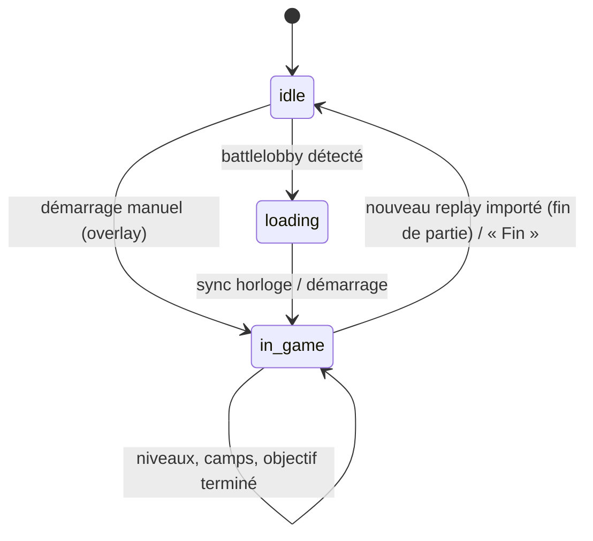

# 3. Stratégie d'analyse temps réel sans lecture mémoire

## 3.1 Le problème
Contrairement à League of Legends (Live Client Data API), **Heroes of the Storm n'expose aucune API temps réel**. Les outils qui affichent des positions, des cooldowns ou l'état exact de la partie lisent la mémoire du processus : c'est exactement ce qui est interdit.

HOTS REVIVAL doit donc produire un overlay utile **à partir de ce que le joueur voit déjà** et de ce qui est **prévisible publiquement**.

> **État (v0.2)** : implémenté. Cycle de partie automatique (processus du jeu, fichier de chargement, replay de fin), carte détectée automatiquement, timers mesurés sur replays réels puis recalibrés sur ceux du joueur, lecture d'écran optionnelle de l'horloge et des niveaux.

## 3.2 Ce que l'on sait sans tricher

| Information | Source légitime | Fiabilité |
|---|---|---|
| Jeu lancé / fermé | Liste des processus (`HeroesOfTheStorm_x64.exe`) | Haute |
| Une partie démarre | `replay.server.battlelobby` apparaît dans `%TEMP%\Heroes of the Storm\…` | Haute |
| Joueurs de la partie | BattleTags du battlelobby (visibles à l'écran de chargement) | Haute (vérifié sur fichier réel) |
| Carte | Dernière dépendance `.s2ma` du battlelobby → identifiant lu dans le cache Battle.net, puis empreinte apprise à la fin de chaque partie | Haute |
| Fin de partie | Nouveau `.StormReplay` enregistré → overlay vidé | Haute |
| Héros joué | Choix du joueur / draft assistant | Haute |
| Horloge de jeu | Lecture d'écran (option) ou synchronisation par le joueur (Ctrl+Shift+S à 0:00), puis horloge locale monotone. Horloge = temps depuis l'ouverture des portes (vérifié : champ `GameTime` des replays) | ±1–2 s |
| Prochain objectif | Timings publics par carte + horloge ; recalage par « objectif terminé » (Ctrl+Shift+J) | Estimation |
| Niveaux d'équipe | Visibles en haut de l'écran pour les deux équipes → lecture d'écran (option) ou raccourcis | Haute si calibré |
| Avantage de talent | Déduit des niveaux (paliers 1/4/7/10/13/16/20) | Haute |
| Camps | Timer lancé par le joueur quand il voit une capture | Haute |
| Build de talents | Statistiques des replays importés (winrate, popularité) | Selon volume |

**Jamais** : positions ennemies, cooldowns ennemis, santé hors vision, contenu du brouillard.

## 3.3 Architecture de la session live

- `LiveSession` (backend) conserve un ancrage `time.monotonic()` correspondant à 0:00 → l'horloge ne dérive pas même si l'UI se fige.
- `compute_overlay()` est une fonction pure de l'état : testable, déterministe.
- Diffusion : WebSocket `/ws/live` toutes les secondes vers l'overlay et la fenêtre principale.
- Entrées : raccourcis globaux Electron → `POST /api/live/*` ; mode interactif de l'overlay (Ctrl+Shift+I) pour cliquer.

## 3.4 Moteur de conseils (règles, sans LLM)

| Déclencheur | Message |
|---|---|
| Objectif dans ≤ 45 s | « Le prochain objectif arrive dans N secondes. » + « Restez groupés. » + priorité « Regroupement » |
| Palier de talent adverse > allié | Alerte « L'équipe adverse possède un avantage de talent. » + « Ne forcez pas un combat en infériorité de talent. » |
| Palier allié > adverse | « Votre équipe possède un avantage niveau N : forcez l'objectif ou un combat. » |
| Niveau allié 10/16/20 | « Niveau 10 atteint. » (une fois) |
| Niveau allié 9/15/19 | « Niveau N imminent : attendez le talent avant d'engager. » |
| Camp allié dispo dans ≤ 20 s | « Camp X disponible dans N s. » |

Les alertes portent un identifiant stable : l'overlay ne les affiche qu'une fois (8 s).

**Pourquoi pas Claude en jeu ?** Latence (secondes), coût par partie, distraction, et surtout aucune donnée supplémentaire à lui fournir : les règles couvrent l'information disponible. Claude est réservé au draft, au rapport et au coaching.

## 3.5 Calibrage des timings
Les replays contiennent l'horloge exacte des évènements de carte (noms vérifiés sur replays réels : `Boss Duel Started`, `Immortal Defeated`, `DragonKnightActivated`, `BraxisHoldoutMapEventComplete`, `VolskayaCapturePointComplete`, `GhostShipCaptured`, `WarheadJunctionNukesSpawned`…). Mesures de référence : Champs de l'Éternité, 1ᵉʳ duel à 2:30 puis ~2:05 après la fin du duel ; Site des ogives, 3:00 puis toutes les ~3:30.
`analytics/timings.py` recalcule, pour chaque carte, la médiane du premier objectif et du délai entre objectifs sur les replays du joueur (≥ 3 parties) ; l'overlay affiche la source (« vos replays », « mesuré » ou « estimation »).

## 3.6 Lecture d'écran (option)
- Capture de l'écran principal (`desktopCapturer`) toutes les 2 s **pendant une partie uniquement**, découpe de 3 zones publiques (horloge, niveau allié, niveau adverse), OCR local (tesseract.js, données embarquées, chiffres uniquement).
- Filtres : valeur lue deux fois de suite, niveaux croissants (+3 max), horloge cohérente avec le temps écoulé.
- Calibrage par le joueur (Paramètres) sur une capture faite en jeu (Ctrl+Shift+K).
- Désactivée par défaut (voir 02-conformite-blizzard.md §2.4).

## 3.7 Limites assumées
- L'overlay n'est visible qu'en **plein écran fenêtré** (une fenêtre ne peut pas se superposer à un mode exclusif sans hook DirectX — interdit).
- Sans saisie des niveaux (MVP), les alertes de powerspike ne se déclenchent pas : l'overlay l'indique.
- Les timers d'objectifs sont des estimations tant que les timings ne sont pas calibrés.
