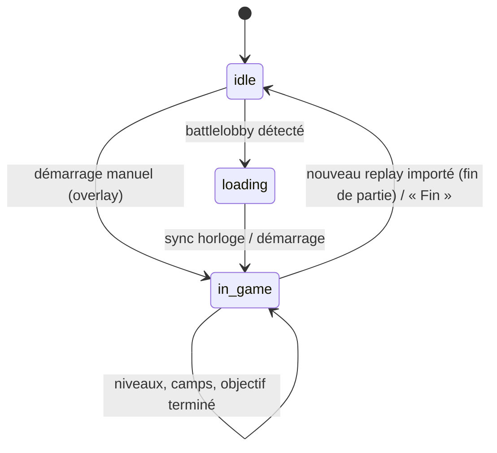

# 3. Stratégie d'analyse temps réel sans lecture mémoire

## 3.1 Le problème
Contrairement à League of Legends (Live Client Data API), **Heroes of the Storm n'expose aucune API temps réel**. Les outils qui affichent des positions, des cooldowns ou l'état exact de la partie lisent la mémoire du processus : c'est exactement ce qui est interdit.

HOTS REVIVAL doit donc produire un overlay utile **à partir de ce que le joueur voit déjà** et de ce qui est **prévisible publiquement**.

## 3.2 Ce que l'on sait sans tricher

| Information | Source légitime | Fiabilité |
|---|---|---|
| Une partie démarre | `replay.server.battlelobby` apparaît dans `%TEMP%\Heroes of the Storm\…` | Haute |
| Joueurs de la partie | BattleTags du battlelobby (visibles à l'écran de chargement) | Haute |
| Carte | Choix du joueur dans l'overlay (V2 : OCR de l'écran de chargement) | Haute |
| Héros joué | Choix du joueur / draft assistant | Haute |
| Horloge de jeu | Synchronisation par le joueur (Ctrl+Shift+S à 0:00, ou saisie) puis horloge locale monotone | ±1–2 s |
| Prochain objectif | Timings publics par carte + horloge ; recalage par « objectif terminé » (Ctrl+Shift+J) | Estimation |
| Niveaux d'équipe | Visibles en haut de l'écran pour les deux équipes → saisis par raccourci (V2 : OCR) | Haute si saisis |
| Avantage de talent | Déduit des niveaux (paliers 1/4/7/10/13/16/20) | Haute |
| Camps | Timer lancé par le joueur quand il voit une capture | Haute |
| Build de talents | Statistiques des replays importés (winrate, popularité) | Selon volume |

**Jamais** : positions ennemies, cooldowns ennemis, santé hors vision, contenu du brouillard.

## 3.3 Architecture de la session live

- `LiveSession` (backend) conserve un ancrage `time.monotonic()` correspondant à 0:00 → l'horloge ne dérive pas même si l'UI se fige.
- `compute_overlay()` est une fonction pure de l'état : testable, déterministe.
- Diffusion : WebSocket `/ws/live` toutes les secondes vers l'overlay et la fenêtre principale.
- Entrées : raccourcis globaux Electron → `POST /api/live/*` ; mode interactif de l'overlay (Ctrl+Shift+I) pour cliquer.

## 3.4 Moteur de conseils (règles, sans LLM)

| Déclencheur | Message |
|---|---|
| Objectif dans ≤ 45 s | « Le prochain objectif arrive dans N secondes. » + « Restez groupés. » + priorité « Regroupement » |
| Palier de talent adverse > allié | Alerte « L'équipe adverse possède un avantage de talent. » + « Ne forcez pas un combat en infériorité de talent. » |
| Palier allié > adverse | « Votre équipe possède un avantage niveau N : forcez l'objectif ou un combat. » |
| Niveau allié 10/16/20 | « Niveau 10 atteint. » (une fois) |
| Niveau allié 9/15/19 | « Niveau N imminent : attendez le talent avant d'engager. » |
| Camp allié dispo dans ≤ 20 s | « Camp X disponible dans N s. » |

Les alertes portent un identifiant stable : l'overlay ne les affiche qu'une fois (8 s).

**Pourquoi pas Claude en jeu ?** Latence (secondes), coût par partie, distraction, et surtout aucune donnée supplémentaire à lui fournir : les règles couvrent l'information disponible. Claude est réservé au draft, au rapport et au coaching.

## 3.5 Calibrage des timings
Les timings de `backend/app/data/maps.json` sont des **valeurs indicatives** (`verified: false`) car Blizzard les a modifiés au fil des patchs. Plan :
1. **MVP** : valeurs par défaut + recalage manuel « objectif terminé ».
2. **Sprint 4** : calcul automatique de la médiane du premier objectif par carte à partir des évènements `objective` des replays importés (déjà stockés en base), écrasant les valeurs par défaut quand l'échantillon ≥ 20 parties.
3. **V2** : agrégation communautaire (cloud) par build du jeu.

## 3.6 V2 : lecture d'écran opt-in (OCR)
- Capture d'écran (API `desktopCapturer`) **uniquement** de deux zones publiques : horloge et niveaux d'équipe.
- OCR local (Tesseract WASM ou modèle de chiffres léger), 1 image / 2 s, aucune image conservée.
- Supprime la saisie manuelle des niveaux et de l'horloge.
- Désactivé par défaut, validation Blizzard préalable (voir 02-conformite-blizzard.md §2.4).

## 3.7 Limites assumées
- L'overlay n'est visible qu'en **plein écran fenêtré** (une fenêtre ne peut pas se superposer à un mode exclusif sans hook DirectX — interdit).
- Sans saisie des niveaux (MVP), les alertes de powerspike ne se déclenchent pas : l'overlay l'indique.
- Les timers d'objectifs sont des estimations tant que les timings ne sont pas calibrés.
