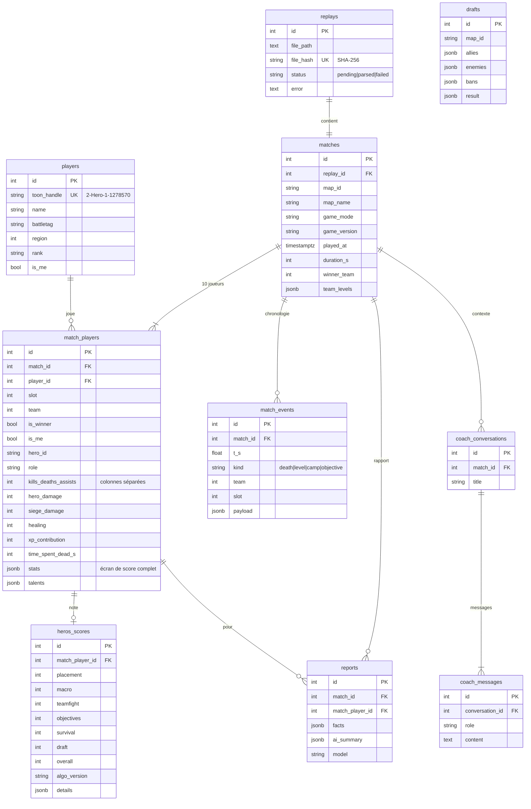

# 6. Base de données

PostgreSQL 16 (JSONB pour les données semi-structurées). Le DDL complet est généré depuis les modèles : [`backend/sql/schema.sql`](../backend/sql/schema.sql) (`python backend/scripts/export_schema.py`).

## 6.1 Modèle entité-association



## 6.2 Choix de modélisation
- **Colonnes dédiées** pour les statistiques interrogées souvent (KDA, dégâts, XP…) ; **JSONB `stats`** pour l'écran de score complet (≈ 80 clés variables selon la carte et le build).
- **HEROS SCORE stocké pour les 10 joueurs** : sert de référentiel comparatif (« votre score vs la moyenne de la partie ») et de corpus de calibrage.
- **`algo_version`** sur le score : recalcul possible lors d'une évolution de la formule.
- **Déduplication** par hash SHA-256 du fichier (`replays.file_hash` unique).
- **`players.toon_handle`** est l'identifiant stable d'un compte HotS par région (le BattleTag complet n'est pas dans les details du replay). Le joueur local est identifié via le chemin `Accounts\<id>\<toon>\Replays` ou `HOTS_PLAYER_TOON_HANDLE`.

## 6.3 Index
`players.toon_handle`, `replays.file_hash` (uniques) ; `matches.map_id`, `matches.played_at` ; `match_players.match_id`, `player_id`, `hero_id`, `is_me` ; `match_events.match_id`, `kind` ; `heros_scores.overall`.

## 6.4 Requêtes types
```sql
-- Winrate par héros du joueur local
SELECT hero_name, count(*) AS games, avg(is_winner::int) AS winrate
FROM match_players WHERE is_me GROUP BY hero_name ORDER BY games DESC;

-- Talents les plus gagnants pour un héros (tous joueurs des replays importés)
SELECT t->>'tier' AS tier, t->>'name' AS talent, count(*) AS games, avg(is_winner::int) AS winrate
FROM match_players, jsonb_array_elements(talents) AS t
WHERE hero_id = 'valla' GROUP BY 1, 2 ORDER BY 1, winrate DESC;

-- Médiane du premier objectif par carte (calibrage overlay)
SELECT m.map_id, percentile_cont(0.5) WITHIN GROUP (ORDER BY e.first_t) AS median_first_objective
FROM matches m JOIN LATERAL (
  SELECT min(t_s) AS first_t FROM match_events WHERE match_id = m.id AND kind = 'objective'
) e ON true GROUP BY m.map_id;
```

## 6.5 Évolutions V2
`users` (compte cloud) + `user_id` sur toutes les tables, `talent_catalog` (noms localisés), `hero_stats_daily` (agrégats matérialisés), `coach_goals` (objectifs suivis), migrations Alembic.
